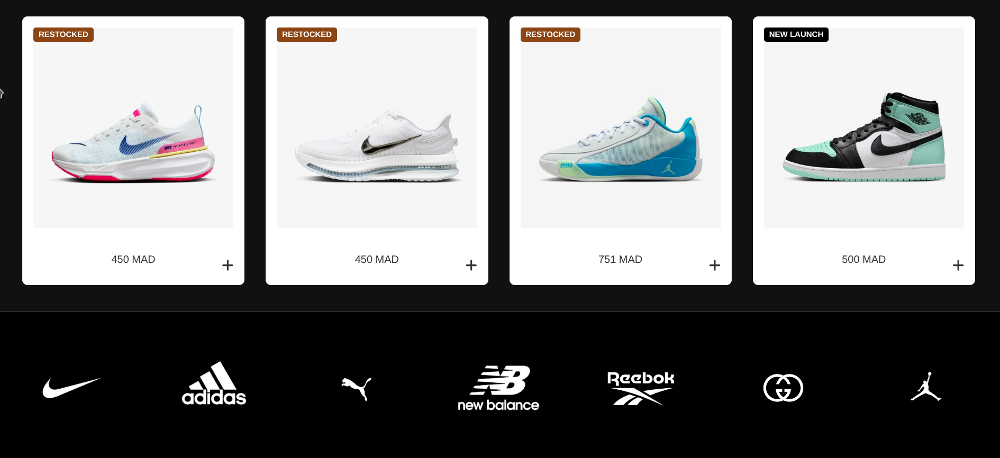

<<<<<<< HEAD
# plz note that this application it not complete not yet it will be complete soon  
=======
this project it not completed not yet ...
>>>>>>> e5d9322 (eco-app version01)
to run this the server use this

python3 -m http.server

this is a prototype of it :

